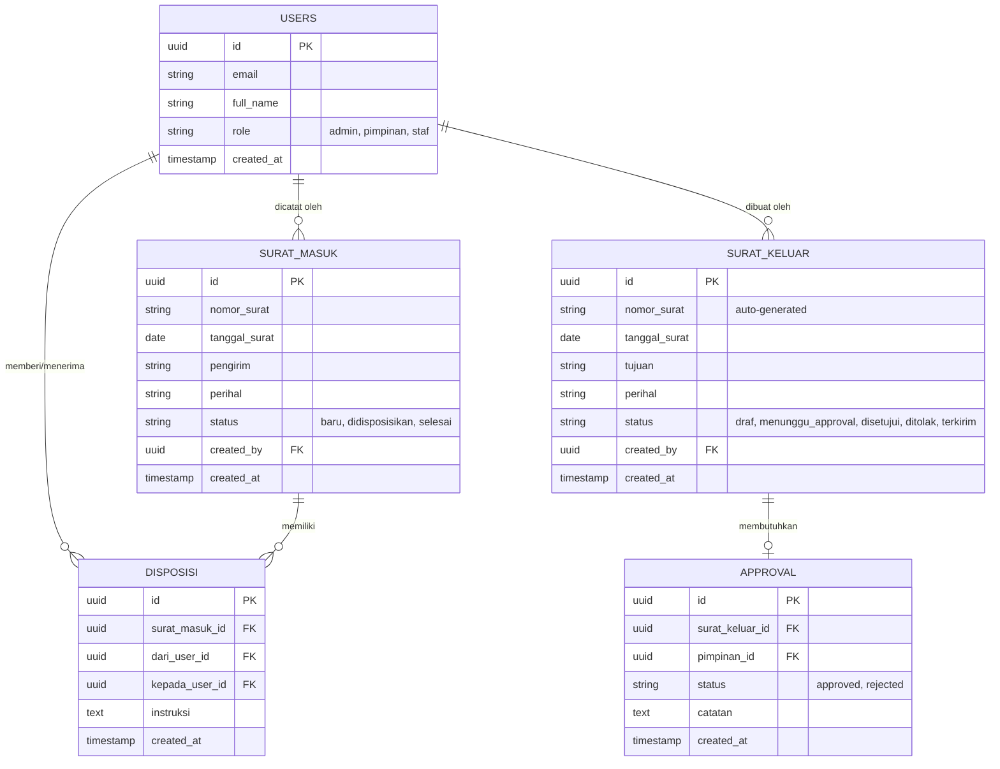

# Entity Relationship Diagram (ERD)

Berikut adalah struktur basis data relasional untuk aplikasi SIPAS menggunakan Supabase (PostgreSQL).

```mermaid
erDiagram
    USERS ||--o{ SURAT_MASUK : "dicatat oleh"
    USERS ||--o{ SURAT_KELUAR : "dibuat oleh"
    USERS ||--o{ DISPOSISI : "memberi/menerima"
    
    SURAT_MASUK ||--o{ DISPOSISI : "memiliki"
    SURAT_KELUAR ||--o| APPROVAL : "membutuhkan"
    
    USERS {
        uuid id PK
        string email
        string full_name
        string role "admin, pimpinan, staf"
        timestamp created_at
    }

    SURAT_MASUK {
        uuid id PK
        string nomor_surat
        date tanggal_surat
        string pengirim
        string perihal
        string status "baru, didisposisikan, selesai"
        uuid created_by FK
        timestamp created_at
    }

    SURAT_KELUAR {
        uuid id PK
        string nomor_surat "auto-generated"
        date tanggal_surat
        string tujuan
        string perihal
        string status "draf, menunggu_approval, disetujui, ditolak, terkirim"
        uuid created_by FK
        timestamp created_at
    }

    DISPOSISI {
        uuid id PK
        uuid surat_masuk_id FK
        uuid dari_user_id FK
        uuid kepada_user_id FK
        text instruksi
        timestamp created_at
    }

    APPROVAL {
        uuid id PK
        uuid surat_keluar_id FK
        uuid pimpinan_id FK
        string status "approved, rejected"
        text catatan
        timestamp created_at
    }
```
