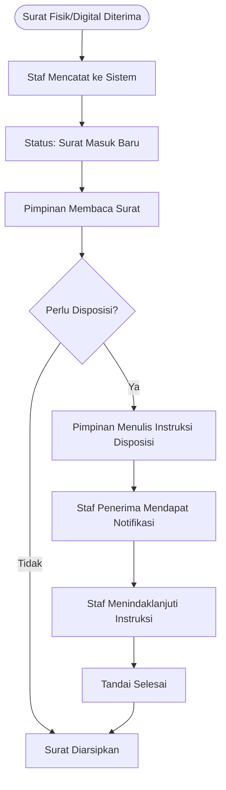

# Alur Kerja (Flowchart)

## Alur Surat Keluar & Persetujuan (Approval)

```mermaid
graph TD
    A([Mulai]) --> B[Staf Membuat Draf Surat Keluar]
    B --> C{Pilih Tindakan}
    C -->|Simpan Draf| D[Surat Tersimpan (Status: Draf)]
    C -->|Ajukan| E[Status: Menunggu Approval]
    
    E --> F[Notifikasi ke Pimpinan]
    F --> G[Pimpinan Memeriksa Surat]
    
    G --> H{Keputusan Pimpinan?}
    H -->|Setuju| I[Status: Disetujui]
    H -->|Tolak| J[Status: Ditolak + Catatan Revisi]
    
    J --> B
    I --> K[Surat Siap Dikirim/Dicetak]
    K --> L([Selesai])
```

## Alur Surat Masuk & Disposisi


