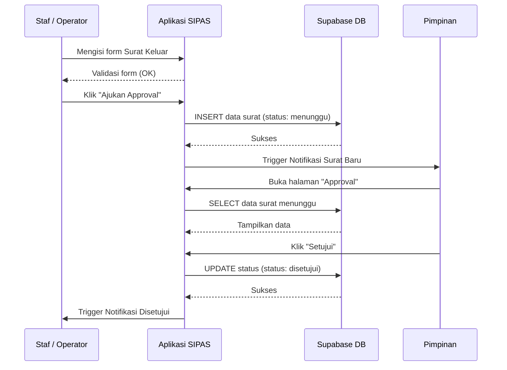

# Activity Diagram

## Pembuatan Surat Keluar

```mermaid
sequenceDiagram
    participant Staf as Staf / Operator
    participant Sistem as Aplikasi SIPAS
    participant DB as Supabase DB
    participant Pimpinan as Pimpinan

    Staf->>Sistem: Mengisi form Surat Keluar
    Sistem-->>Staf: Validasi form (OK)
    Staf->>Sistem: Klik "Ajukan Approval"
    Sistem->>DB: INSERT data surat (status: menunggu)
    DB-->>Sistem: Sukses
    Sistem->>Pimpinan: Trigger Notifikasi Surat Baru
    Pimpinan->>Sistem: Buka halaman "Approval"
    Sistem->>DB: SELECT data surat menunggu
    DB-->>Sistem: Tampilkan data
    Pimpinan->>Sistem: Klik "Setujui"
    Sistem->>DB: UPDATE status (status: disetujui)
    DB-->>Sistem: Sukses
    Sistem->>Staf: Trigger Notifikasi Disetujui
```
