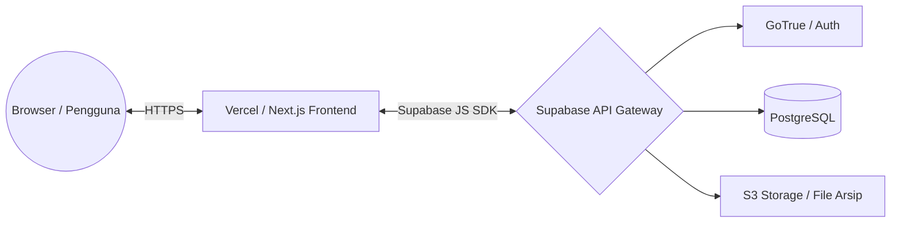

# System Architecture

## Gambaran Umum Arsitektur SIPAS

SIPAS dikembangkan menggunakan arsitektur **Serverless** dan **BaaS (Backend as a Service)** untuk memaksimalkan kecepatan pengembangan dan skalabilitas.

### Komponen Utama:
1. **Frontend (Client-Side)**
   - **Framework:** Next.js 14 (React) dengan mode Single Page Application (SPA) / Client Components.
   - **Styling:** Tailwind CSS + Shadcn UI + Magic UI (untuk animasi tingkat tinggi).
   - **State Management:** React Hooks (`useState`, `useEffect`).
   - **Routing:** Next.js App Router.

2. **Backend (BaaS)**
   - **Platform:** Supabase.
   - **Database:** PostgreSQL.
   - **Autentikasi:** Supabase Auth (JWT Base).
   - **Security:** Row Level Security (RLS) di database untuk membatasi akses baca/tulis berdasarkan *Role* pengguna.

3. **Hosting & Deployment**
   - **Frontend:** Vercel (CI/CD otomatis setiap kali ada push ke GitHub).
   - **Database:** Cloud Supabase terkelola.

### Diagram Arsitektur

