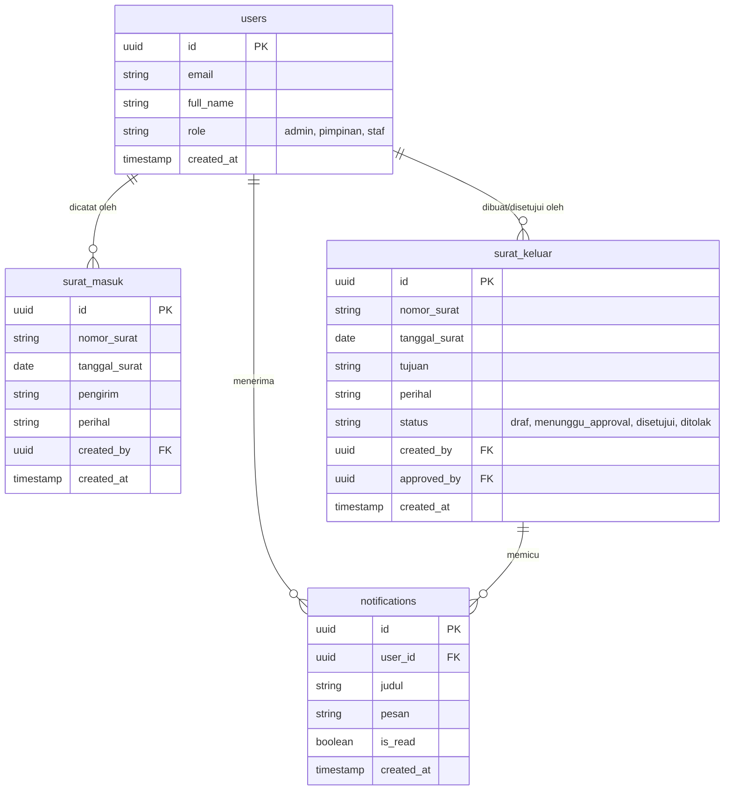

# Entity Relationship Diagram (ERD)

```mermaid
erDiagram
    users ||--o{ surat_masuk : "dicatat oleh"
    users ||--o{ surat_keluar : "dibuat/disetujui oleh"
    users ||--o{ notifications : "menerima"
    surat_keluar ||--o{ notifications : "memicu"

    users {
        uuid id PK
        string email
        string full_name
        string role "admin, pimpinan, staf"
        timestamp created_at
    }

    surat_masuk {
        uuid id PK
        string nomor_surat
        date tanggal_surat
        string pengirim
        string perihal
        uuid created_by FK
        timestamp created_at
    }

    surat_keluar {
        uuid id PK
        string nomor_surat
        date tanggal_surat
        string tujuan
        string perihal
        string status "draf, menunggu_approval, disetujui, ditolak"
        uuid created_by FK
        uuid approved_by FK
        timestamp created_at
    }

    notifications {
        uuid id PK
        uuid user_id FK
        string judul
        string pesan
        boolean is_read
        timestamp created_at
    }
```
