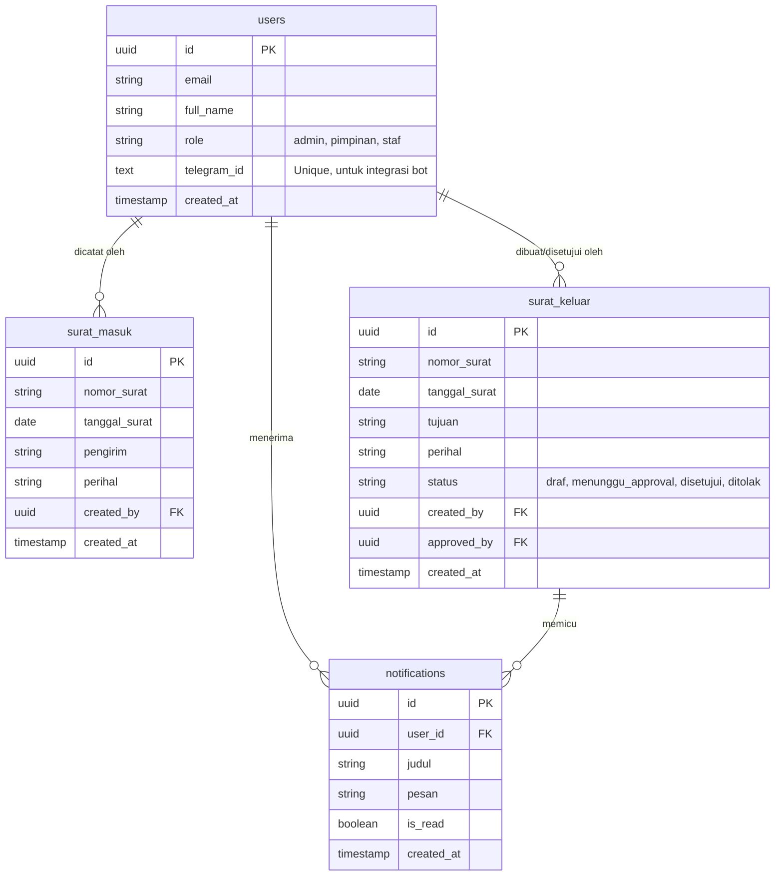

# Entity Relationship Diagram (ERD) - SIPAS v2.2.0



---

## Penjelasan Relasi

### users
- **Primary Key**: `id` (UUID)
- **Unique Constraints**: `email`, `telegram_id`
- **Role Values**: `admin`, `pimpinan`, `staf`
- **telegram_id**: Field baru untuk integrasi dengan Telegram Bot SIPAS (optional, nullable)

### surat_masuk
- **Primary Key**: `id` (UUID)
- **Foreign Key**: `created_by` → `users.id`
- Pencatatan surat yang diterima oleh instansi

### surat_keluar
- **Primary Key**: `id` (UUID)
- **Foreign Keys**: 
  - `created_by` → `users.id` (pembuat surat)
  - `approved_by` → `users.id` (yang menyetujui, nullable)
- **Status Values**: `draf`, `menunggu_approval`, `disetujui`, `ditolak`

### notifications
- **Primary Key**: `id` (UUID)
- **Foreign Key**: `user_id` → `users.id`
- Sistem notifikasi realtime untuk workflow approval

---

## Database Constraints & Indexes

```sql
-- Unique constraints
ALTER TABLE users ADD CONSTRAINT users_telegram_id_unique UNIQUE (telegram_id);

-- Indexes for performance
CREATE INDEX IF NOT EXISTS idx_users_telegram_id ON users (telegram_id) WHERE telegram_id IS NOT NULL;
CREATE INDEX IF NOT EXISTS idx_surat_keluar_status ON surat_keluar (status);
CREATE INDEX IF NOT EXISTS idx_notifications_user_unread ON notifications (user_id, is_read);
```

---

## Security (Row Level Security)

Semua tabel menggunakan RLS (Row Level Security) Supabase:
- **users**: Admin full access, user lain hanya baca profil sendiri
- **surat_masuk**: Semua authenticated user bisa baca
- **surat_keluar**: Creator bisa baca/edit, pimpinan bisa approve
- **notifications**: User hanya bisa baca notifikasi sendiri
