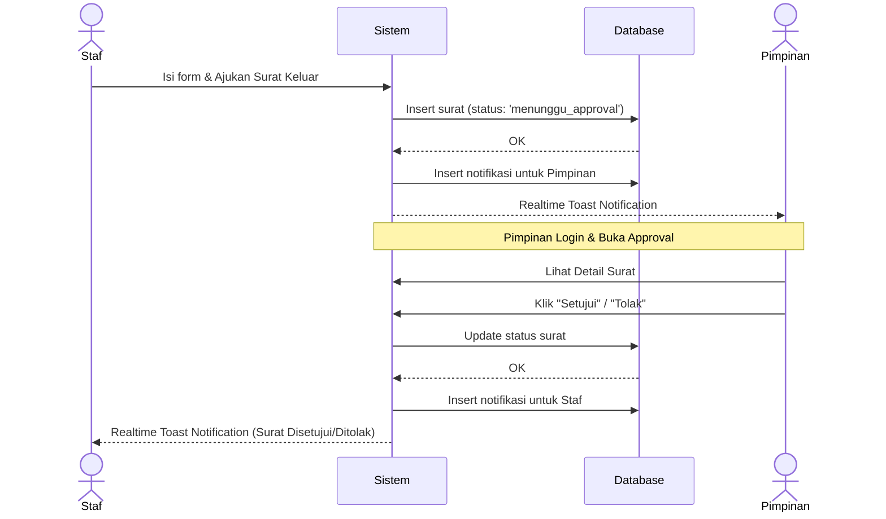
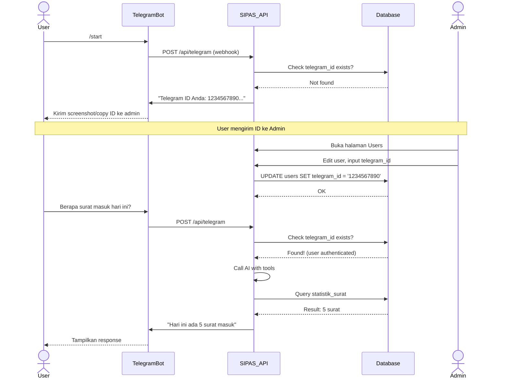
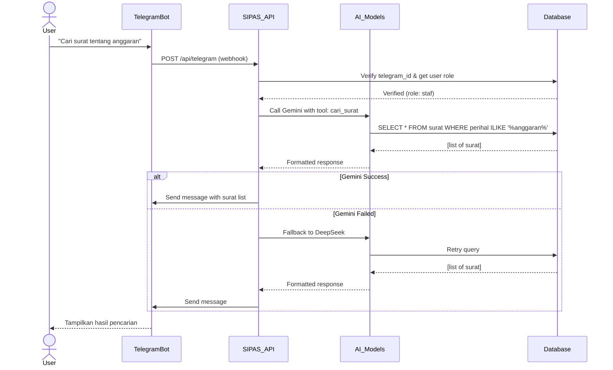
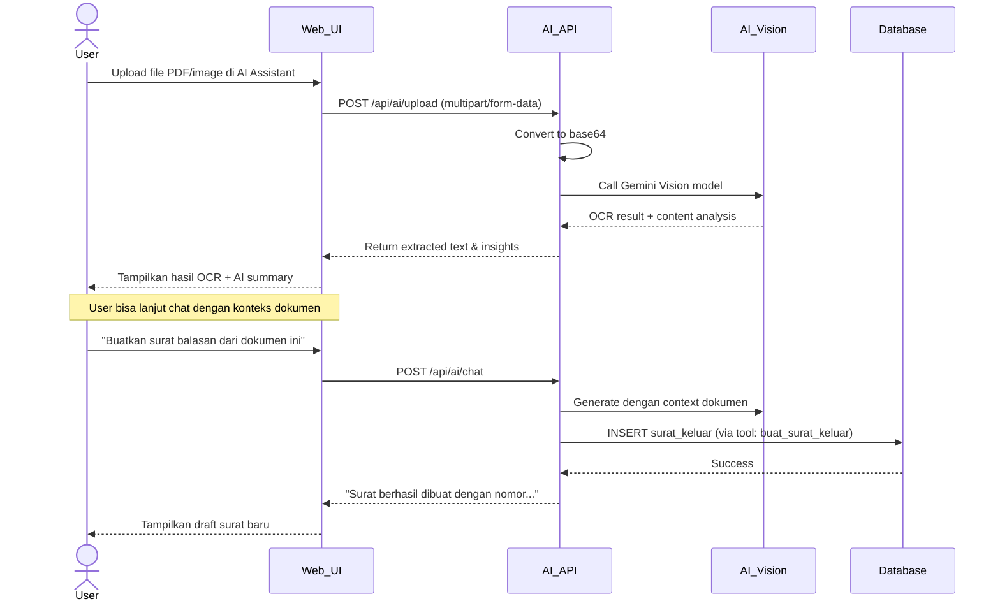
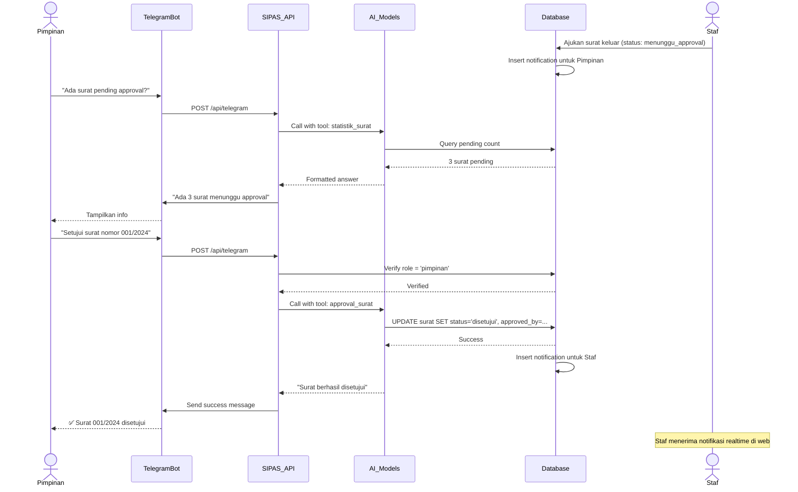

# Activity Diagram - SIPAS v2.0

## 1. Proses Pembuatan dan Approval Surat Keluar (Web)

---

## 2. Telegram Bot - Alur Registrasi User

---

## 3. Telegram Bot - Alur Query Data via AI

---

## 4. AI Assistant - Upload & Analisis Dokumen

---

## 5. Approval Surat via Telegram Bot

---

## Notes

- Semua aktivitas Telegram Bot terintegrasi penuh dengan database SIPAS
- AI Models menggunakan sistem fallback: Gemini → DeepSeek → OpenRouter
- Role-based access control diterapkan baik di web maupun Telegram Bot
- Real-time notifications menggunakan Supabase Realtime Channels
