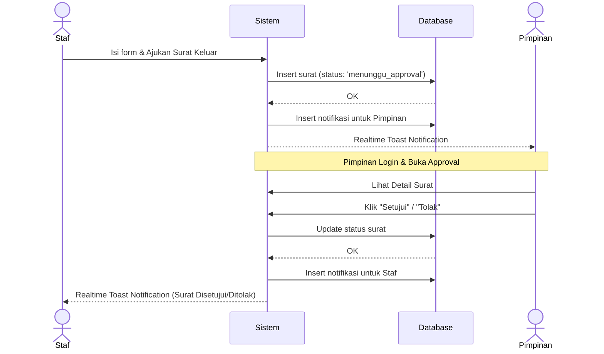

# Activity Diagram

## Proses Pembuatan dan Approval Surat Keluar

```mermaid
sequenceDiagram
    actor Staf
    participant Sistem
    participant Database
    actor Pimpinan

    Staf->>Sistem: Isi form & Ajukan Surat Keluar
    Sistem->>Database: Insert surat (status: 'menunggu_approval')
    Database-->>Sistem: OK
    Sistem->>Database: Insert notifikasi untuk Pimpinan
    Sistem-->>Pimpinan: Realtime Toast Notification
    
    Note over Pimpinan,Sistem: Pimpinan Login & Buka Approval
    
    Pimpinan->>Sistem: Lihat Detail Surat
    Pimpinan->>Sistem: Klik "Setujui" / "Tolak"
    Sistem->>Database: Update status surat
    Database-->>Sistem: OK
    Sistem->>Database: Insert notifikasi untuk Staf
    Sistem-->>Staf: Realtime Toast Notification (Surat Disetujui/Ditolak)
```
