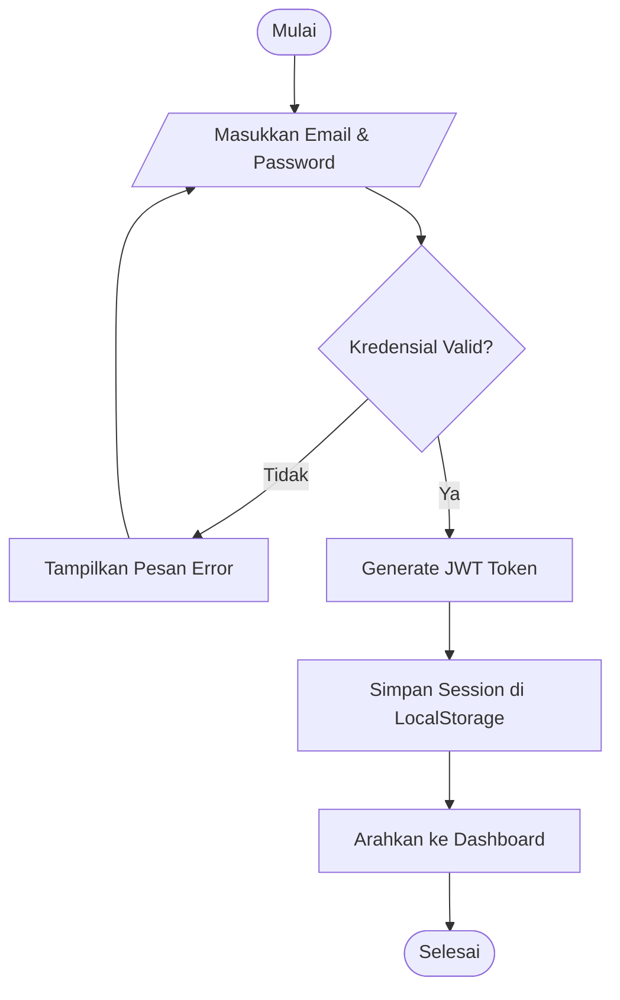
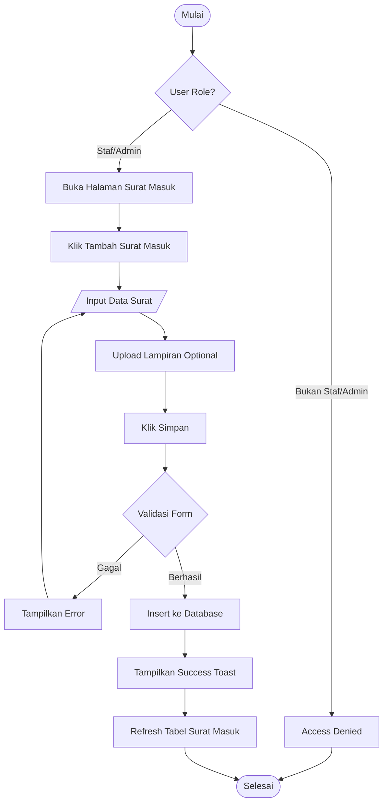
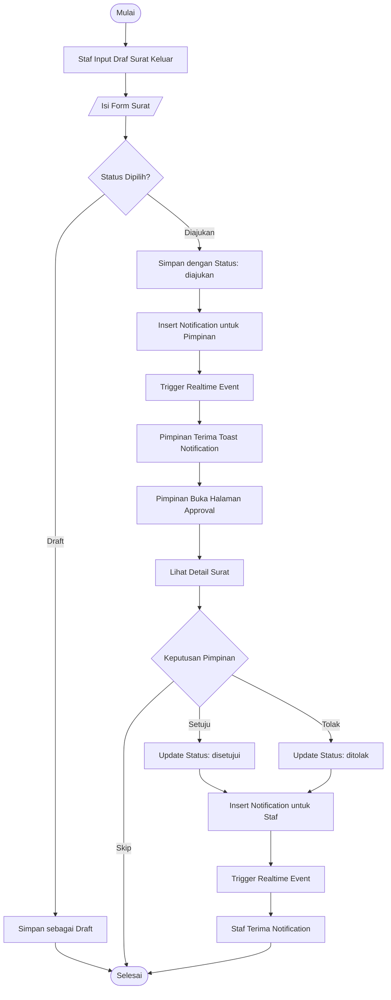
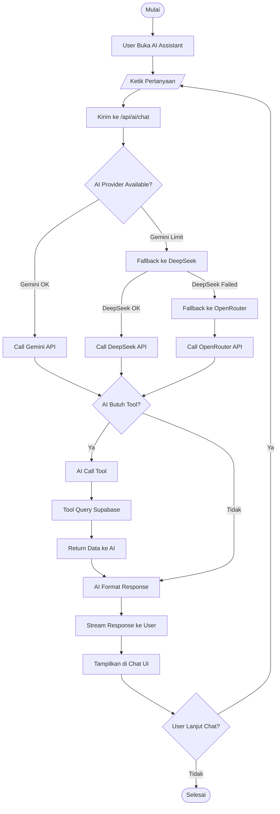
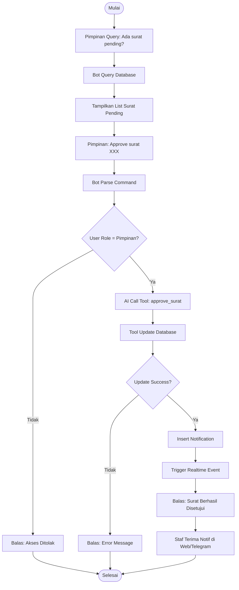

# Flowchart Sistem

## 1. Flowchart Login


---

## 2. Flowchart Input Surat Masuk


---

## 3. Flowchart Surat Keluar & Approval


---

## 4. Flowchart AI Assistant Chat


---

## 5. Flowchart Telegram Bot Registration
```mermaid
graph TD
    A([Mulai]) --> B[User Cari Bot di Telegram]
    B --> C[Ketik /start]
    C --> D[Bot Terima Webhook]
    D --> E[/api/telegram Route Handler]
    E --> F{Command = /start?}
    F -->|Tidak| G[Proses sebagai Query]
    F -->|Ya| H[Get Telegram User ID]
    H --> I[Generate Welcome Message]
    I --> J[Tampilkan Telegram ID ke User]
    J --> K[User Screenshot/Copy ID]
    K --> L[User Kirim ID ke Admin]
    L --> M[Admin Login ke SIPAS Web]
    M --> N[Buka Halaman Users]
    N --> O[Edit User]
    O --> P[Input Telegram ID]
    P --> Q[Klik Simpan]
    Q --> R[Update Database]
    R --> S[User Sekarang Bisa Query Bot]
    S --> Z([Selesai])
```

---

## 6. Flowchart Telegram Bot Query
```mermaid
graph TD
    A([Mulai]) --> B[User Kirim Pesan ke Bot]
    B --> C[Telegram API Kirim Webhook]
    C --> D[/api/telegram POST Handler]
    D --> E[Extract Message & User ID]
    E --> F{User ID Terdaftar?}
    F -->|Tidak| G[Balas: Akses Ditolak]
    G --> Z([Selesai])
    F -->|Ya| H[Get User Data dari Database]
    H --> I[Send Typing Indicator]
    I --> J[Build AI System Prompt]
    J --> K[Call AI dengan Tools]
    K --> L{AI Provider}
    L -->|Gemini| M[Try Gemini]
    M -->|Success| N[Get Response]
    M -->|Failed| O[Try DeepSeek]
    O -->|Success| N
    O -->|Failed| P[Try OpenRouter]
    P --> N
    
    N --> Q{AI Called Tool?}
    Q -->|Ya| R[Execute Tool]
    R --> S[Query Supabase]
    S --> T[Return Data]
    T --> U[AI Format Result]
    Q -->|Tidak| U
    
    U --> V{Response Valid?}
    V -->|Tidak| W[Fallback Message]
    V -->|Ya| X[Format untuk Telegram]
    W --> X
    X --> Y[Send Message via Telegram API]
    Y --> Z
```

---

## 7. Flowchart Approval via Telegram


---

## 8. Flowchart Document Upload & AI Analysis


---

## 9. Flowchart Real-time Notification


---

## 10. Flowchart Dark Mode Toggle

