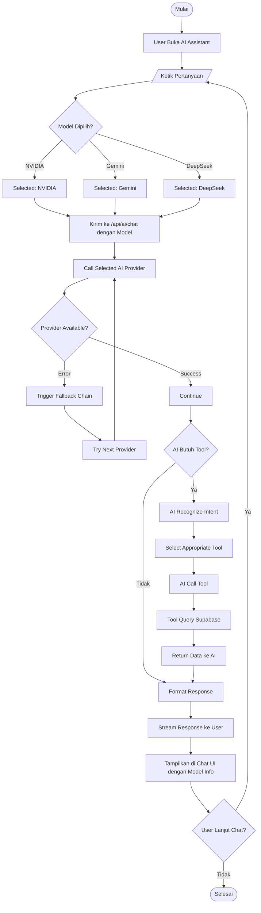
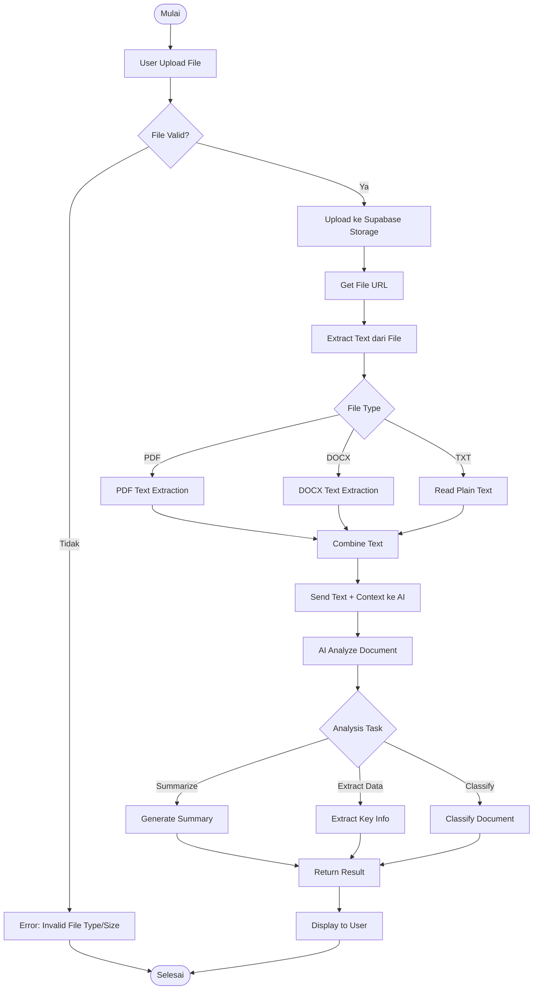
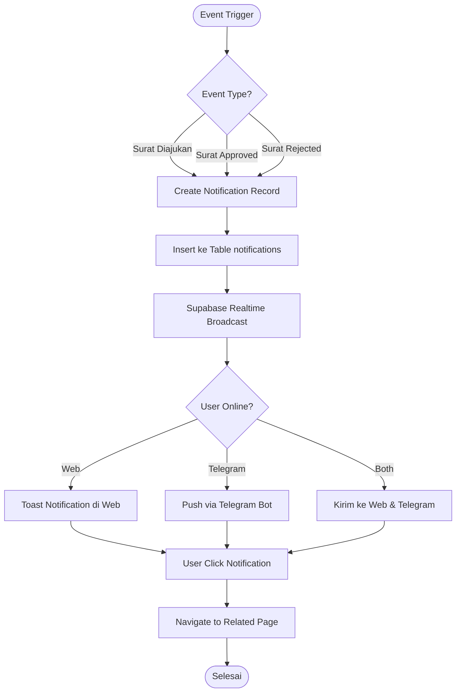
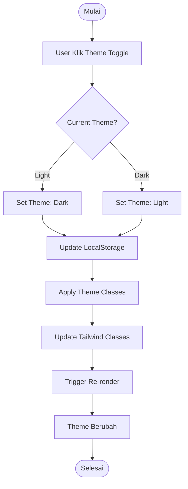
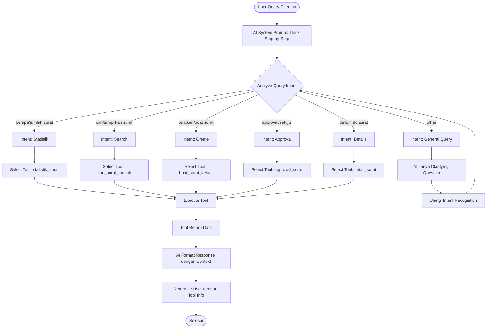
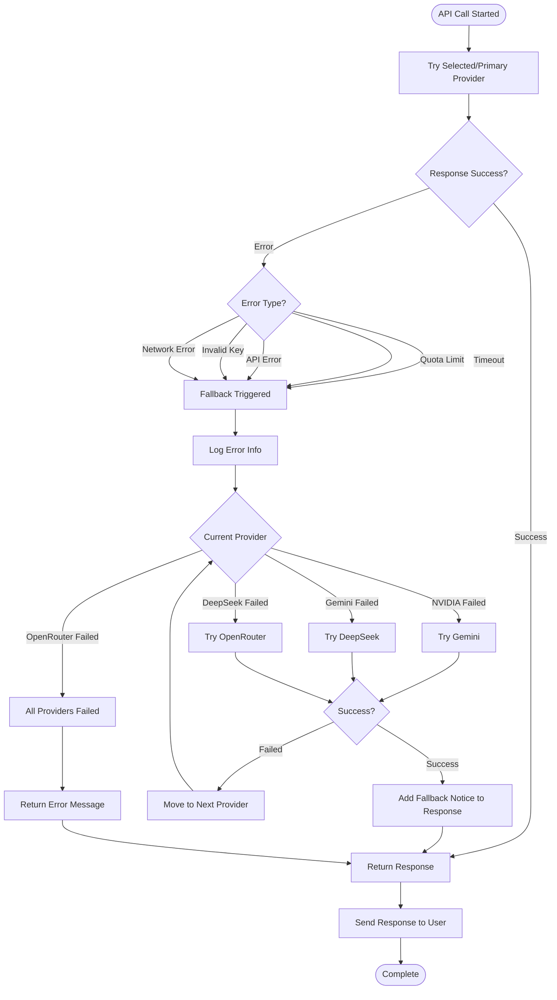

# Flowchart Sistem

## 1. Flowchart Login


---

## 2. Flowchart Input Surat Masuk


---

## 3. Flowchart Surat Keluar & Approval


---

## 4. Flowchart AI Assistant Chat (with NVIDIA Primary)


---

## 5. Flowchart Telegram Bot Registration
```mermaid
graph TD
    A([Mulai]) --> B[User Cari Bot di Telegram]
    B --> C[Ketik /start]
    C --> D[Bot Terima Webhook]
    D --> E[/api/telegram Route Handler]
    E --> F{Command = /start?}
    F -->|Tidak| G[Proses sebagai Query]
    F -->|Ya| H[Get Telegram User ID]
    H --> I[Generate Welcome Message]
    I --> J[Tampilkan Telegram ID ke User]
    J --> K[User Screenshot/Copy ID]
    K --> L[User Kirim ID ke Admin]
    L --> M[Admin Login ke SIPAS Web]
    M --> N[Buka Halaman Users]
    N --> O[Edit User]
    O --> P[Input Telegram ID]
    P --> Q[Klik Simpan]
    Q --> R[Update Database]
    R --> S[User Sekarang Bisa Query Bot]
    S --> Z([Selesai])
```

---

## 6. Flowchart Telegram Bot Query (with NVIDIA Primary)
```mermaid
graph TD
    A([Mulai]) --> B[User Kirim Pesan ke Bot]
    B --> C[Telegram API Kirim Webhook]
    C --> D[/api/telegram POST Handler]
    D --> E[Extract Message & User ID]
    E --> F{User ID Terdaftar?}
    F -->|Tidak| G[Balas: Akses Ditolak]
    G --> Z([Selesai])
    F -->|Ya| H[Get User Data dari Database]
    H --> I[Send Typing Indicator]
    I --> J[Build AI System Prompt]
    J --> K[Call AI dengan Tools]
    K --> L{Primary: NVIDIA}
    L -->|Try NVIDIA| M[Call NVIDIA NIM]
    M -->|Success| N[Get Response]
    M -->|Error| O[Fallback ke Gemini]
    O -->|Try Gemini| P[Call Gemini API]
    P -->|Success| N
    P -->|Error| Q[Fallback ke DeepSeek]
    Q -->|Try DeepSeek| R[Call DeepSeek API]
    R -->|Success| N
    R -->|Error| S[Fallback ke OpenRouter]
    S -->|Try OpenRouter| T[Call OpenRouter]
    T --> N
    
    N --> U{AI Called Tool?}
    U -->|Ya| V[Execute Tool]
    V --> W[Query Supabase]
    W --> X[Return Data]
    X --> Y[AI Format Result]
    U -->|Tidak| Y
    
    Y --> AA{Response Valid?}
    AA -->|Tidak| AB[Fallback Message]
    AA -->|Ya| AC[Format untuk Telegram]
    AB --> AC
    AC --> AD[Send Message via Telegram API]
    AD --> Z
```

---

## 7. Flowchart Approval via Telegram


---

## 8. Flowchart Document Upload & AI Analysis


---

## 9. Flowchart Real-time Notification


---

## 10. Flowchart Dark Mode Toggle


---

## 11. Flowchart AI Intent Recognition (v2.2.0)


---

## 12. Flowchart AI Fallback Mechanism (v2.2.0)

