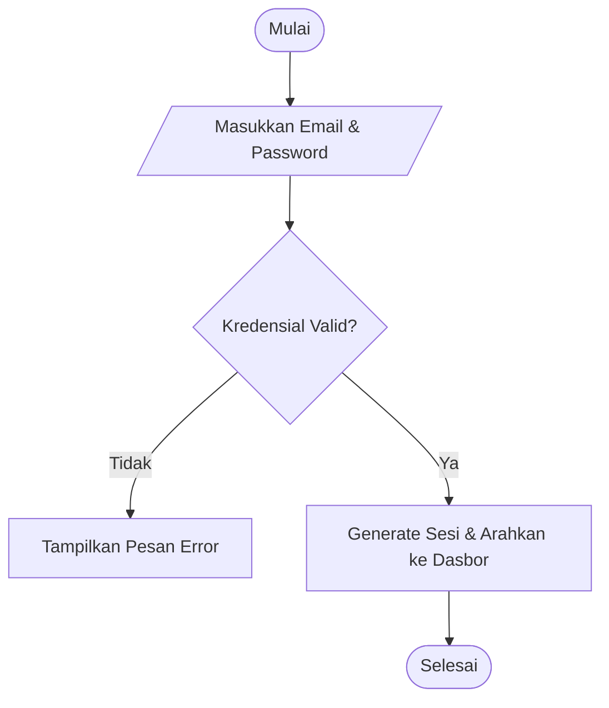
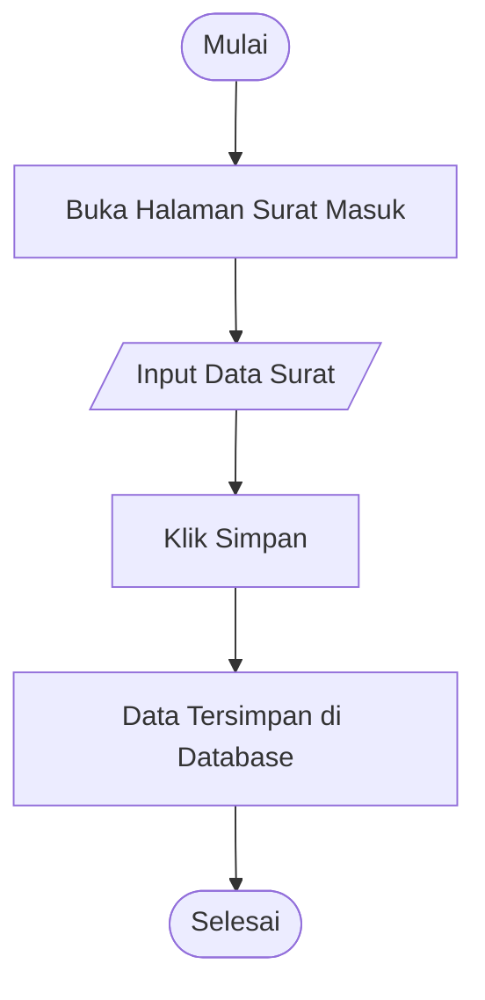
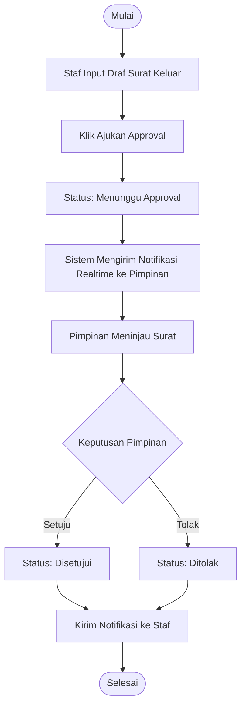

# Flowchart Sistem

## 1. Flowchart Login

```mermaid
graph TD
    A([Mulai]) --> B[/Masukkan Email & Password/]
    B --> C{Kredensial Valid?}
    C -->|Tidak| D[Tampilkan Pesan Error]
    C -->|Ya| E[Generate Sesi & Arahkan ke Dasbor]
    E --> F([Selesai])
```

## 2. Flowchart Input Surat Masuk

```mermaid
graph TD
    A([Mulai]) --> B[Buka Halaman Surat Masuk]
    B --> C[/Input Data Surat/]
    C --> D[Klik Simpan]
    D --> E[Data Tersimpan di Database]
    E --> F([Selesai])
```

## 3. Flowchart Surat Keluar & Approval

```mermaid
graph TD
    A([Mulai]) --> B[Staf Input Draf Surat Keluar]
    B --> C[Klik Ajukan Approval]
    C --> D[Status: Menunggu Approval]
    D --> E[Sistem Mengirim Notifikasi Realtime ke Pimpinan]
    E --> F[Pimpinan Meninjau Surat]
    F --> G{Keputusan Pimpinan}
    G -->|Setuju| H[Status: Disetujui]
    G -->|Tolak| I[Status: Ditolak]
    H --> J[Kirim Notifikasi ke Staf]
    I --> J
    J --> K([Selesai])
```
