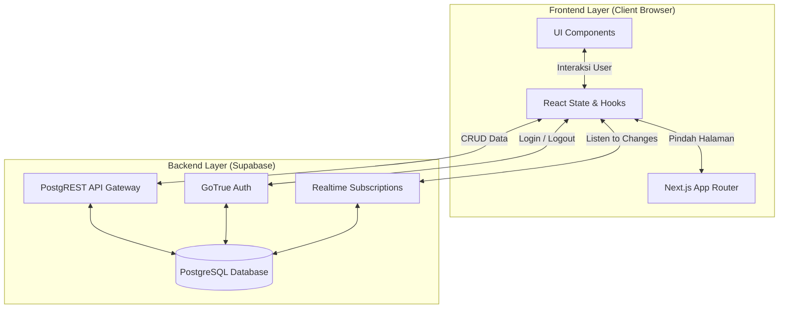

# System Architecture

```mermaid
graph TD
    subgraph "Frontend Layer (Client Browser)"
        UI[UI Components]
        State[React State & Hooks]
        Router[Next.js App Router]
    end

    subgraph "Backend Layer (Supabase)"
        API[PostgREST API Gateway]
        Auth[GoTrue Auth]
        Realtime[Realtime Subscriptions]
        DB[(PostgreSQL Database)]
    end

    UI <--> |Interaksi User| State
    State <--> |Pindah Halaman| Router
    
    State <--> |CRUD Data| API
    State <--> |Login / Logout| Auth
    State <--> |Listen to Changes| Realtime
    
    API <--> DB
    Auth <--> DB
    Realtime <--> DB
```
