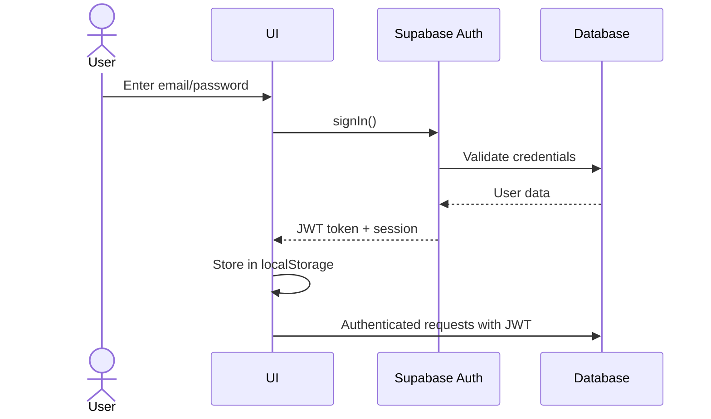
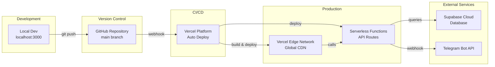

# System Architecture

## Overview
SIPAS menggunakan arsitektur modern berbasis **Jamstack** dengan **serverless functions** dan **real-time database**. Sistem terintegrasi dengan **AI providers** dan **Telegram Bot API** untuk memberikan pengalaman multi-platform.

---

## Architecture Diagram

```mermaid
graph TD
    subgraph "Client Layer"
        WEB[Web Browser]
        TG[Telegram App]
    end

    subgraph "Frontend Layer (Next.js)"
        UI[UI Components<br/>Tailwind + Shadcn]
        State[React State & Hooks]
        Router[Next.js App Router<br/>Turbopack]
    end

    subgraph "API Layer (Vercel Serverless)"
        API_AI[/api/ai/chat<br/>AI Assistant]
        API_TG[/api/telegram<br/>Bot Webhook]
        API_USERS[/api/users<br/>User Management]
    end

    subgraph "AI Providers"
        NVIDIA[NVIDIA NIM<br/>Primary - FREE]
        GEMINI[Google Gemini<br/>Fallback 1]
        DEEPSEEK[DeepSeek<br/>Fallback 2]
        OPENROUTER[OpenRouter<br/>Fallback 3]
    end

    subgraph "External Services"
        TG_API[Telegram Bot API]
    end

    subgraph "Backend Layer (Supabase)"
        SB_API[PostgREST API Gateway]
        SB_AUTH[GoTrue Auth]
        SB_RT[Realtime Subscriptions]
        SB_DB[(PostgreSQL Database)]
        SB_STORAGE[Storage<br/>File Upload]
    end

    %% Client connections
    WEB --> UI
    TG --> TG_API
    TG_API --> API_TG

    %% Frontend flow
    UI <--> State
    State <--> Router
    State --> API_AI
    State --> API_USERS

    %% API to Services
    API_AI --> NVIDIA
    API_AI -.-> GEMINI
    API_AI -.-> DEEPSEEK
    API_AI -.-> OPENROUTER
    API_TG --> NVIDIA
    API_TG -.-> GEMINI
    API_TG -.-> DEEPSEEK
    API_TG -.-> OPENROUTER

    %% Supabase connections
    State --> SB_API
    State --> SB_AUTH
    State --> SB_RT
    State --> SB_STORAGE
    
    API_AI --> SB_API
    API_TG --> SB_API
    API_USERS --> SB_AUTH

    SB_API <--> SB_DB
    SB_AUTH <--> SB_DB
    SB_RT <--> SB_DB
    SB_STORAGE <--> SB_DB

    %% Styling
    classDef primary fill:#3b82f6,stroke:#1e40af,color:#fff
    classDef secondary fill:#10b981,stroke:#059669,color:#fff
    classDef external fill:#f59e0b,stroke:#d97706,color:#fff
    classDef storage fill:#8b5cf6,stroke:#6d28d9,color:#fff

    class WEB,TG,UI primary
    class API_AI,API_TG,API_USERS secondary
    class NVIDIA,GEMINI,DEEPSEEK,OPENROUTER,TG_API external
    class SB_DB,SB_STORAGE storage
```

---

## Component Details

### 1. **Client Layer**
- **Web Browser**: Desktop/mobile web access
- **Telegram App**: Mobile bot access untuk quick operations

### 2. **Frontend Layer**
- **Next.js 16.2.4**: React framework dengan App Router
- **Turbopack**: Fast build tool untuk development
- **Tailwind CSS**: Utility-first styling
- **Shadcn UI**: Reusable component library
- **Dark Mode**: Theme switching dengan next-themes

### 3. **API Layer (Serverless)**
Berjalan di **Vercel Edge Functions**:

| Endpoint | Purpose | Auth Required |
|----------|---------|---------------|
| `/api/ai/chat` | AI Assistant chat interface | ✅ Yes |
| `/api/ai/upload` | Document upload & analysis | ✅ Yes |
| `/api/telegram` | Telegram bot webhook | ❌ No (Telegram validates) |
| `/api/telegram/set-webhook` | Register webhook URL | ❌ No (admin only) |
| `/api/users` | Create new users | ✅ Yes (admin only) |

### 4. **AI Providers**
Multi-provider dengan **automatic fallback** untuk reliability maksimal:

| Provider | Model | Cost | Quota | Status |
|----------|-------|------|-------|--------|
| **NVIDIA NIM** | meta/llama-3.1-70b-instruct | 🆓 FREE | ♾️ Unlimited | ⭐ Primary (Recommended) |
| **Gemini** | gemini-2.5-flash | 🆓 FREE | ~15 req/min | Fallback 1 |
| **DeepSeek** | deepseek-chat | 💰 Pay-per-use | ~60 req/min | Fallback 2 |
| **OpenRouter** | openrouter/free | 🆓 FREE | Varies by model | Fallback 3 |

**Fallback Logic** (Auto-switch on error):
```
Try NVIDIA → (error/timeout?) → Try Gemini → (quota limit?) 
→ Try DeepSeek → (failed?) → Try OpenRouter → (all failed?) → Error message
```

**Model Selection**:
- Users can manually select model via UI dropdown (NVIDIA, Gemini, DeepSeek)
- Default: **NVIDIA** (recommended - gratis & tanpa limit)
- System auto-fallback jika model yang dipilih gagal

**Setup Guide**: Lihat [NVIDIA-API-SETUP.md](../NVIDIA-API-SETUP.md) untuk cara mendapatkan API key gratis.

### 5. **Telegram Integration**
- **Webhook Mode**: Real-time message delivery
- **Bot API**: Send messages, typing indicators, markdown
- **Self-Registration**: Users get Telegram ID via `/start`
- **Whitelist**: Only registered users can access

### 6. **Backend Layer (Supabase)**

#### **PostgreSQL Database**
Tables:
- `users` - User accounts dengan telegram_id
- `surat_masuk` - Incoming letters
- `surat_keluar` - Outgoing letters  
- `notifications` - Real-time notifications

#### **PostgREST API**
- Auto-generated REST API dari database schema
- Row Level Security (RLS) untuk data isolation
- Real-time subscriptions via WebSocket

#### **GoTrue Auth**
- Email/password authentication
- JWT tokens untuk session management
- Role-based access control

#### **Supabase Storage**
- File upload untuk lampiran surat
- Public/private buckets
- CDN-backed delivery

---

## Data Flow Examples

### Flow 1: Web User Query Surat
```
User (Web) → UI Component → React State → Supabase Client 
→ PostgREST API → PostgreSQL → Response → UI Update
```

### Flow 2: Telegram Bot Query
```
User (Telegram) → Telegram API → Vercel Webhook (/api/telegram)
→ AI Provider (NVIDIA/Gemini/DeepSeek) → Tool Execution → Supabase Query
→ Format Response → Send to Telegram → User receives message
```

### Flow 3: AI Assistant Chat (with Model Selection)
```
User selects model (NVIDIA/Gemini/DeepSeek) → Send message
→ /api/ai/chat → Selected AI Provider (with tools)
→ Tool calls Supabase → Get data → AI formats response
→ Return to user → Display in chat (with streaming)

If error occurs:
→ Auto fallback to next available provider
→ Continue processing → Return response with fallback notice
```

---

## Security Architecture

### Authentication Flow


### RLS (Row Level Security)
- **users**: Users can only read their own data
- **surat_masuk**: Visible to all authenticated users
- **surat_keluar**: Staf can see their own, Pimpinan can see all
- **notifications**: Users only see their own notifications

---

## Deployment Architecture



---

## Performance Considerations

### Caching Strategy
- **Static Pages**: Pre-rendered at build time
- **Dynamic Data**: Client-side fetch dengan SWR
- **AI Responses**: No caching (always fresh)
- **Supabase Queries**: Client-side caching via React Query

### Optimization
- **Code Splitting**: Automatic via Next.js
- **Image Optimization**: Next.js Image component
- **Bundle Size**: Tree-shaking unused code
- **Edge Functions**: Low latency globally

---

## Scalability

### Horizontal Scaling
- **Vercel**: Auto-scales serverless functions
- **Supabase**: Managed PostgreSQL with connection pooling
- **Telegram**: Webhook can handle high volume

### Rate Limiting
- **NVIDIA**: Unlimited (free tier) ⭐ **RECOMMENDED**
- **Gemini**: 15 requests/minute (free tier)
- **DeepSeek**: Pay-per-use, no hard limit
- **OpenRouter**: Free tier quotas vary by model
- **Fallback system** ensures 99.9% availability
