# Use Case Diagram

## Diagram Utama

```mermaid
graph TB
    subgraph Actors
        ADMIN[Admin]
        STAF[Staf]
        PMP[Pimpinan]
        BOT[Telegram Bot]
    end

    subgraph "Sistem Informasi Persuratan SIPAS"
        subgraph "User Management"
            UC1[Kelola User]
            UC11[Daftarkan Telegram ID]
        end
        
        subgraph "Surat Masuk"
            UC2[Input Surat Masuk]
            UC21[Lihat Surat Masuk]
            UC22[Cari Surat Masuk]
        end
        
        subgraph "Surat Keluar"
            UC3[Buat Surat Keluar]
            UC31[Lihat Surat Keluar]
            UC32[Cari Surat Keluar]
        end
        
        subgraph "Approval System"
            UC4[Approve Surat]
            UC41[Reject Surat]
            UC42[Lihat Pending Approval]
        end
        
        subgraph "AI Assistant"
            UC5[Chat dengan AI]
            UC51[Upload Dokumen]
            UC52[Query Natural Language]
        end
        
        subgraph "Telegram Bot"
            UC6[Registrasi via Bot]
            UC61[Query via Telegram]
            UC62[Approve via Telegram]
        end
        
        subgraph "Notifications"
            UC7[Terima Notifikasi Web]
            UC71[Terima Notifikasi Telegram]
        end
        
        subgraph "Reports & Statistics"
            UC8[Lihat Dashboard]
            UC81[Lihat Statistik]
        end
    end

    %% Admin connections
    ADMIN --> UC1
    ADMIN --> UC11
    ADMIN --> UC21
    ADMIN --> UC31
    ADMIN --> UC5
    ADMIN --> UC7
    ADMIN --> UC8
    ADMIN --> UC81

    %% Staf connections
    STAF --> UC2
    STAF --> UC21
    STAF --> UC22
    STAF --> UC3
    STAF --> UC31
    STAF --> UC32
    STAF --> UC5
    STAF --> UC51
    STAF --> UC52
    STAF --> UC7
    STAF --> UC8

    %% Pimpinan connections
    PMP --> UC21
    PMP --> UC31
    PMP --> UC4
    PMP --> UC41
    PMP --> UC42
    PMP --> UC5
    PMP --> UC7
    PMP --> UC8
    PMP --> UC81

    %% Telegram Bot connections
    BOT --> UC6
    BOT --> UC61
    BOT --> UC62
    BOT --> UC71

    %% Styling
    classDef actor fill:#3b82f6,stroke:#1e40af,color:#fff
    classDef usecase fill:#10b981,stroke:#059669,color:#fff
    classDef bot fill:#f59e0b,stroke:#d97706,color:#fff

    class ADMIN,STAF,PMP actor
    class BOT bot
    class UC1,UC2,UC3,UC4,UC5,UC6,UC7,UC8 usecase
    class UC11,UC21,UC22,UC31,UC32,UC41,UC42,UC51,UC52,UC61,UC62,UC71,UC81 usecase
```

---

## Detail Use Cases

### 1. User Management (Admin)

#### UC1: Kelola User
- **Actor**: Admin
- **Description**: Menambah, mengedit, atau menghapus user
- **Precondition**: Admin sudah login
- **Flow**:
  1. Admin membuka halaman Users
  2. Pilih action: Tambah/Edit/Hapus
  3. Isi form user (nama, email, role, status)
  4. Sistem validasi dan simpan
- **Postcondition**: User berhasil dikelola

#### UC11: Daftarkan Telegram ID
- **Actor**: Admin
- **Description**: Mendaftarkan Telegram ID user untuk akses bot
- **Precondition**: User sudah chat `/start` di bot
- **Flow**:
  1. User dapat Telegram ID dari bot
  2. User kirim ID ke Admin
  3. Admin buka halaman Users
  4. Admin edit user dan input Telegram ID
  5. Sistem validasi dan simpan
- **Postcondition**: User dapat akses bot

---

### 2. Surat Masuk (Staf)

#### UC2: Input Surat Masuk
- **Actor**: Staf
- **Description**: Mencatat surat masuk baru
- **Precondition**: Staf sudah login
- **Flow**:
  1. Staf buka halaman Surat Masuk
  2. Klik "Tambah Surat Masuk"
  3. Isi form (nomor, tanggal, pengirim, perihal)
  4. Upload lampiran (optional)
  5. Klik Simpan
- **Postcondition**: Surat masuk tersimpan

#### UC21: Lihat Surat Masuk
- **Actor**: Admin, Staf, Pimpinan
- **Description**: Melihat daftar surat masuk
- **RLS**: Semua authenticated user bisa lihat

#### UC22: Cari Surat Masuk
- **Actor**: Staf
- **Description**: Mencari surat berdasarkan keyword
- **Tools**: Search bar, filter status, date range

---

### 3. Surat Keluar (Staf)

#### UC3: Buat Surat Keluar
- **Actor**: Staf
- **Description**: Membuat draf surat keluar
- **Precondition**: Staf sudah login
- **Flow**:
  1. Staf buka halaman Surat Keluar
  2. Klik "Tambah Surat Keluar"
  3. Isi form (nomor, tanggal, tujuan, perihal)
  4. Pilih status: Draft atau Diajukan
  5. Jika Diajukan → trigger notification ke Pimpinan
- **Postcondition**: Surat keluar tersimpan

---

### 4. Approval System (Pimpinan)

#### UC4: Approve Surat
- **Actor**: Pimpinan
- **Description**: Menyetujui surat keluar
- **Precondition**: Ada surat dengan status "diajukan"
- **Flow**:
  1. Pimpinan terima notifikasi
  2. Buka halaman Approval
  3. Lihat detail surat
  4. Klik "Setujui"
  5. Sistem update status → "disetujui"
  6. Trigger notification ke Staf pembuat
- **Postcondition**: Surat disetujui

#### UC41: Reject Surat
- **Actor**: Pimpinan
- **Description**: Menolak surat keluar
- **Flow**: Sama dengan UC4, tapi klik "Tolak" + isi alasan

#### UC42: Lihat Pending Approval
- **Actor**: Pimpinan
- **Description**: Melihat daftar surat menunggu approval
- **Query**: `status = 'diajukan'`

---

### 5. AI Assistant (All Users)

#### UC5: Chat dengan AI
- **Actor**: Admin, Staf, Pimpinan
- **Description**: Tanya AI tentang surat menggunakan natural language
- **Precondition**: User sudah login
- **Flow**:
  1. User buka halaman AI Assistant
  2. Ketik pertanyaan (contoh: "Berapa surat masuk hari ini?")
  3. AI proses → panggil tool → query database
  4. AI format hasil → tampilkan ke user
- **AI Tools**:
  - `cari_surat_masuk`
  - `cari_surat_keluar`
  - `statistik_surat`
  - `approve_surat` (Pimpinan only)
  - `reject_surat` (Pimpinan only)

#### UC51: Upload Dokumen
- **Actor**: Staf
- **Description**: Upload dokumen untuk dianalisis AI
- **File Types**: PDF, DOCX, TXT
- **Max Size**: 10MB

#### UC52: Query Natural Language
- **Actor**: All Users
- **Description**: Query database menggunakan bahasa natural
- **Examples**:
  2. Ketik `/start`
  3. Bot balas dengan Telegram ID
  4. User kirim ID ke Admin
  5. Admin input ID di sistem
- **Postcondition**: User dapat akses bot

#### UC61: Query via Telegram
- **Actor**: Registered Telegram Users
- **Description**: Query surat via Telegram
- **Features**:
  - Natural language query
  - Same AI tools as web
  - Role-based access
  - Markdown responses
- **Example**: "Berapa surat masuk hari ini?"

#### UC62: Approve via Telegram
- **Actor**: Pimpinan (via Telegram)
- **Description**: Approve surat langsung dari Telegram
- **Example**: "Approve surat 001/SK/2026"

---

### 7. Notifications

#### UC7: Terima Notifikasi Web
- **Actor**: All Users
- **Description**: Real-time toast notifications di web
- **Triggers**:
  - Surat baru diajukan
  - Surat disetujui/ditolak
  - Mention dalam comment

#### UC71: Terima Notifikasi Telegram
- **Actor**: Users dengan Telegram ID terdaftar
- **Description**: Push notifications via Telegram bot
- **Same triggers** as UC7

---

### 8. Reports & Statistics

#### UC8: Lihat Dashboard
- **Actor**: All Users
- **Description**: Melihat dashboard dengan overview
- **Content**:
  - Total surat masuk/keluar
  - Pending approval count
  - Recent activities
  - Quick actions

#### UC81: Lihat Statistik
- **Actor**: Admin, Pimpinan
- **Description**: Melihat statistik detail
- **Charts**:
  - Surat per bulan (line chart)
  - Surat per status (pie chart)
  - Approval time avg

---

## Access Matrix

| Use Case | Admin | Staf | Pimpinan |
|----------|-------|------|----------|
| Kelola User | ✅ | ❌ | ❌ |
| Input Surat Masuk | ✅ | ✅ | ❌ |
| Buat Surat Keluar | ✅ | ✅ | ❌ |
| Approve/Reject Surat | ✅ | ❌ | ✅ |
| Chat AI Assistant | ✅ | ✅ | ✅ |
| Query via Telegram | ✅ | ✅ | ✅ |
| Lihat Statistik | ✅ | ✅ | ✅ |

✅ = Akses Diberikan | ❌ = Akses Ditolak
